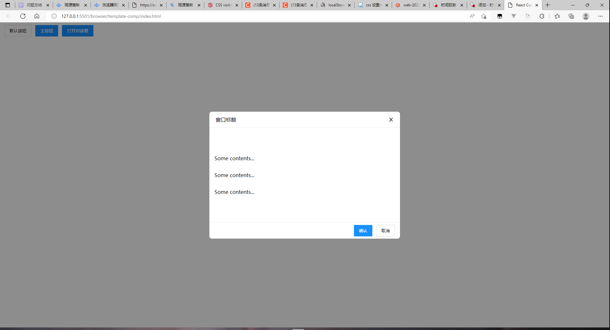
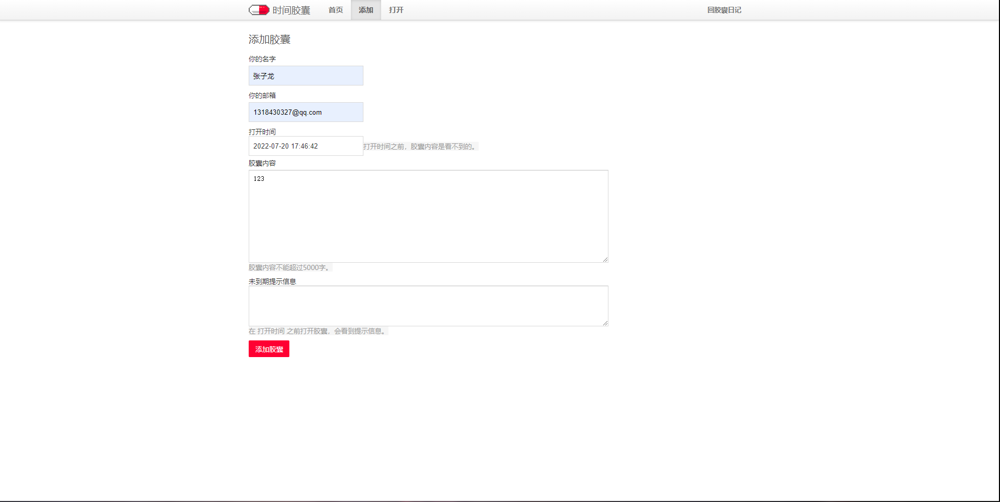
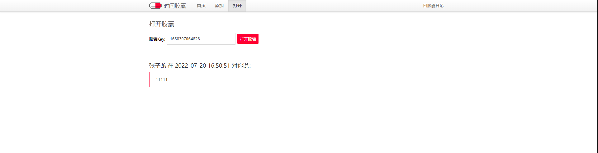
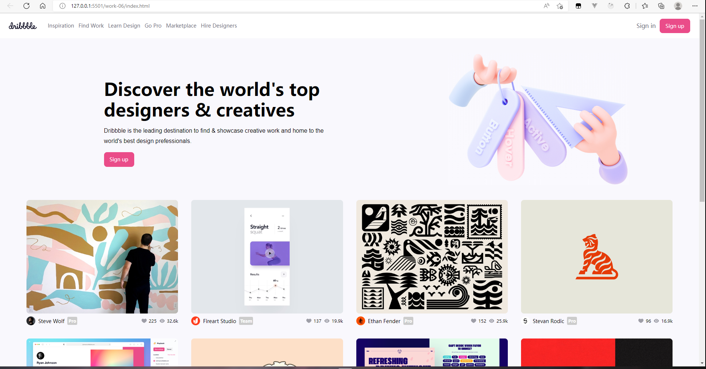
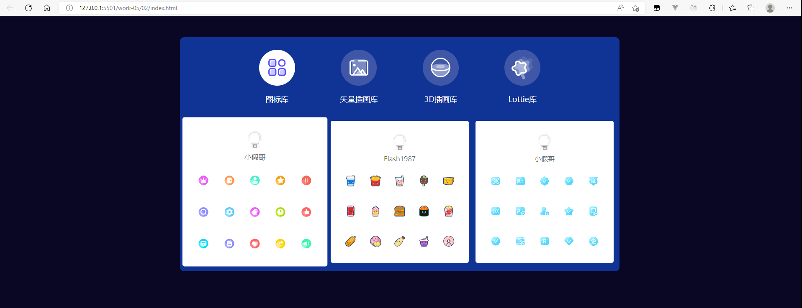
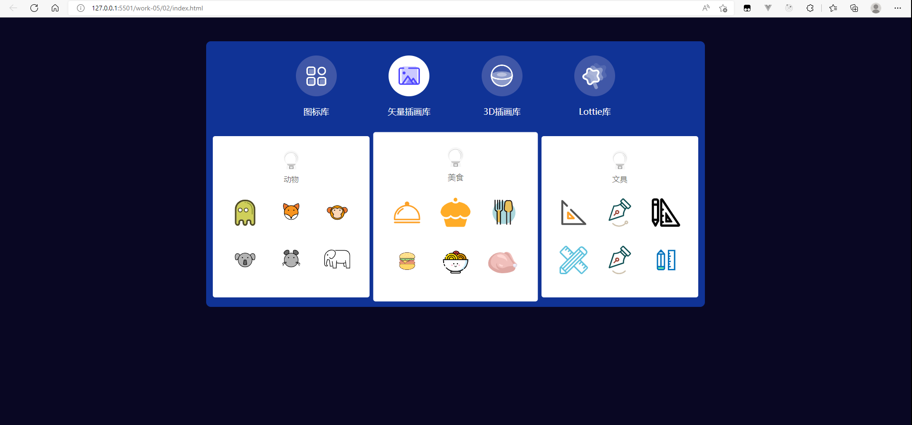
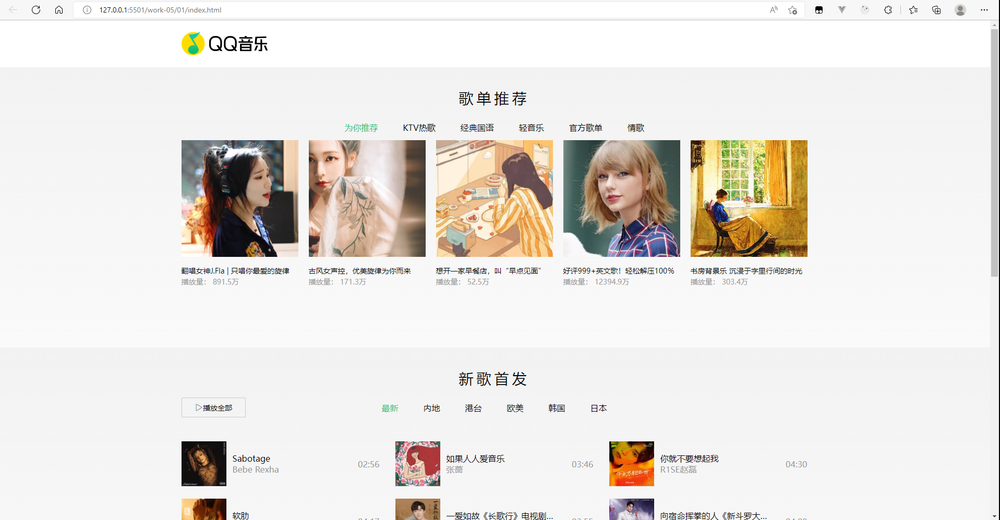
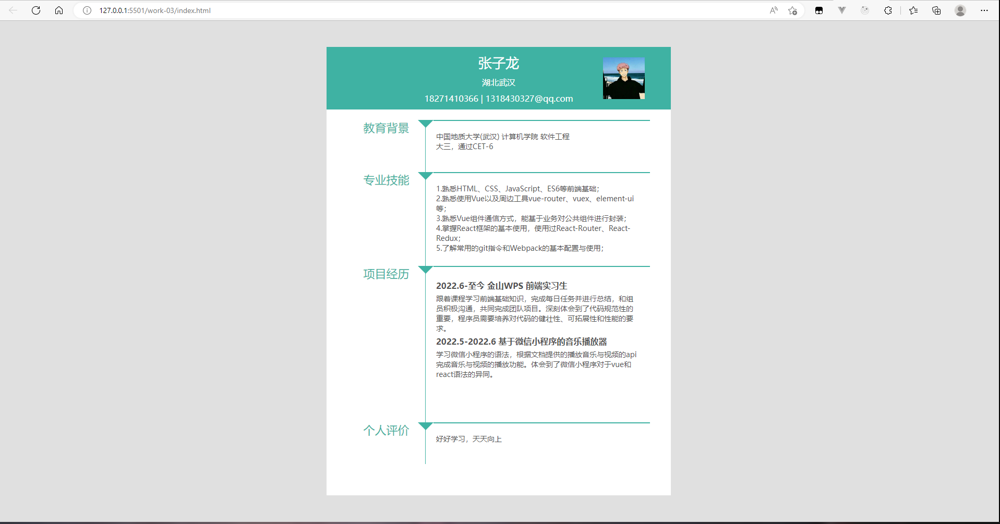
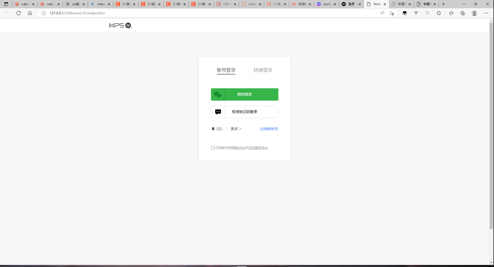
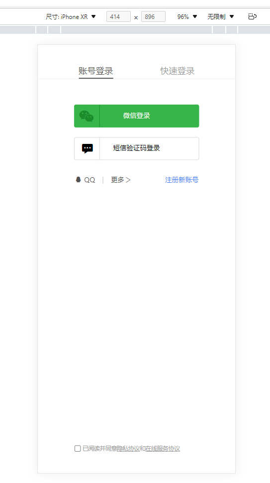

# 8 月 22 日

1. 学习了minimist对于命令行参数的解析，完成了ls遍历当前目录的文件和文件夹功能
2. 完成了cloc命令统计不同类型文件的注释行数，空行，实际代码行数，思路是对文件内容进行切割，对切割出来的数据进行判断统计
3. 熟悉掌握了path.join，readDirSync,process.cwd()等方法和属性

# 8 月 19 日

1. 在数据统计页面，当单选题多选题没有收集到数据时，将这部分内容设置为文字显示未填写，而不是展示空列表。
2. 在React中想实现类似Vue的路由守卫判断前一次页面是否为期望的地址时，可以通过将上一次页面的地址作为state参数传给下一个页面，下一个页面判断是否接收到了正确的state参数，如果没有，则重定向到其他页面，实现路由拦截功能。
3. 学习了nodejs的fs模块、buffer模块、path模块等，学习了全局变量process的一些属性和方法 

# 8 月 18 日

1. 修改了滚动条的样式，其实不占据页面空间并且更符合官网的样式。
2. 使用echarts对收集的表单进行数据统计，将数据可视化为饼图和柱状图。

# 8 月 17 日

1. 学习了开发过程中将localhost的本地网址通过whistle模拟部署后的地址进行开发。
2. 由于表单是按需加载的，当最后一页的最后一个数据被删除时，此时应该请求前一个页面的数据，修复了此前还是请求当前页的bug。
3. 编写了文档部分内容，描述了模块的功能以及设计思路。

# 8 月 16 日

1. 完成了移动端适配和提交成功后显示成功页面。
2. 对代码进行规范化，将eslint的警告全部消除，将使用any类型的地方进行修改。
3. 对用户输入的地方进行校验。

# 8 月 15 日

1. 完成了个人中心页面，实现更换头像，修改密码，修改用户名等功能。
2. 使用全局变量控制表单的一个子项是否处于激活状态，当用户点击App组件时，让所有表单的子项失活，改变子项的样式，当用户点击子项时，将子项重新激活。
3. 在封装fetch的函数中控制spin组件是否显示，当开始请求时，将spin组件设置为block，请求完成后，将组件设置为none。实现请求时间过长时出现loading页面。
4. 要注意冒泡机制，当触发子组件的点击事件时，也会触发父组件的点击事件，可能会产生与预期不符的结果，此时需要将子组件的点击事件阻止冒泡。

# 8 月 12 日

1. 完成了分享功能，使用qrcode生成二维码，扫描后会得到填写表单的网址。
2. 更改了样式，使其更接近于官网。
3. 修复了一些bug，当用户登录后，需要将用户名和图像存入localstorage里，如果只放在context里进行管理，页面刷新后context内容就会消失。

# 8 月 11 日

1. 完成了表单提交，表单收集等功能，对必填项进行校验，显示表单收集的数量和结果等信息。
2. 在对一个对象添加属性时，可以使用item["result"]添加result属性，在删除属性时，使用delete item.result。
3. splice会对原数组产生影响，并且splice方法的返回值为被删除的数据，而不是剩余的数据。
4. 在操作对象数据时，很容易因为引用变量的缘故造成一些不正常的结果，保险起见需要将对象数据先展开，将其地址变为一个新地址，然后再进行赋值操作

# 8 月 10 日

1. 完成了大多数核心功能。
2. 使用useNavigationType判断用户进入这个路由页面的方式是不是push或replace过来的，如果不是，在需要路由传参的页面就跳转到其他页面，实现路由拦截功能
3. 学习了overflow: overlay的用法，设置之后滚轮不占据页面空间
4. 复用了结构相同或逻辑相同的部分

# 8 月 9 日

1. 完成了创建表单里的所有题型的创建，对相同的结构和样式进行复用，体会到了自定义Hooks共享逻辑的方便之处
2. 在使用css module进行开发时遇到需要改变antd样式的问题

# 8 月 8 日

1. 完成了大作业的登录注册，权限校验，填空题表单创建。
2. 完成表单列表的静态结构。
3. 使用Context管理登录人的信息和创建的表单信息。
4. 使用自定义Hooks设置添加填空题至表单的函数。

# 8 月 5 日

1. 学习了自定义Hooks和全局状态管理Context，一个是共享逻辑，一个是共享数据。
2. 完成了work11，体会到了全局状态管理的方便之处，对代码进行复用和使用useCallback进行优化。
3. 使用scss里的mixin，include对css代码进行优化。
4. 使用context时，生产者提供的数据必须是state数据，这样才能保证数据改变时，组件重新渲染。

# 8 月 4 日

1. 学习了Context用法，可以使用多个context管理多个不同的状态，生产者提供数据，消费者使用数据，消费者找离他最近的生产者拿数据
2. Router V6 中的NavLink 的classname可以传一个回调函数，回调函数的参数为当前标签是否为激活状态，在回调函数里根据传入的状态动态控制类名，可以搭配classnames(npm包)使用
3. 学习了Hooks的用法，当改变状态是由上一次的状态改变时，应该传递一个回调函数保证数据不会产生异步问题，学习使用useMemo和useCallback优化代码

# 8 月 3 日

1. 完成了中期练习前台项目的Class版
2. 完成了bug修复
### 遇到的问题
1. splice返回值是删除的数据，不是更改后的数组
2. mobx的数据为数组时，直接打印出来是proxy包裹，可以直接读取数组的值
3. 下拉加载的实现使用scroll事件进行监听，当触底后再次请求数据。pageindex应还是设置为1，而pagesize翻倍

# 8 月 2 日

1. 学习了MobX的使用，把数据放在store里，让所有组件都可以很方便的读取和更改store存储的数据
2. 对代码的一些警告提示进行修改，将代码进行规范，修复bug

# 8 月 1 日

1. 熟练掌握了antd里的Table,Form,Modal等组件的使用
2. 对fetch请求进行封装，设置了拦截功能，每次请求得到响应之后，判断是否有权限，没有权限则跳转到登录页面
```js
   const res = await fetch(url, option)
   const json: T = await res.json()
   if (!window.location.pathname.includes('login')&&res.status === 401) {
      window.location.replace('/login');
      return Promise.reject('Unauthorized.');
   }
   return json
```

# 7 月 29 日

1. 学习了scss，掌握了嵌套，变量，混合等特性的使用
2. 学习了css Module，防止组件之间存在命名冲突的问题
3. 开始中期练习的初始工作，制定了项目设计规范、完成了小组成员的任务分工和使用git分支共同开发

# 7 月 28 日

1. 在实现受控组件时，如果有多个表单元素需要监听，可以使用高阶函数进行封装，表单里的 event 类型可以设置为 React.FormEvent，点击事件的 event 类型可以设置为 React.MouseEvent

```js
// 受控组件
  setVal = (name:string) => {
    return (event:React.FormEvent)=>{
      this.setState({
        [name]: (event.target as HTMLInputElement).value
      });
    }
  };
```

2. 在实现移动端适配时，可以使用 rem 适配，将 html 的 font-size 设置为 100vw/750 或使用 window.onresize 监听窗口的大小改变，从而更改 html 的字体大小
3. react 的 setstate 里第二个参数可以传一个回调函数，会在组件渲染完之后调用，此时可以读取 state 的最新值
4. 当 state 的对象或数组时，若想改变其中某个属性的值，要先将旧的 state 展开，然后添加新的值

```js
setFormData({
  ...formData,
  inputDate: e.target.value,
});
```

# 7 月 27 日

1. 在 React 中，在同一个函数内部更改 state 的值之后无法读取到最新的 state 值的原因？
   - 在 React 中，如果执行的一次函数中有多个更改自身状态 state 的操作，react 会自动将其整合成一个整体，然后再进行更改 state 操作，从这里也可以看出 react 更新自身 state 的操作是异步的，不可以在同一个函数里，既更新 state，又读取更新后的值，此时只能读到上一次旧的 state 的值。
2. react 项目设置代理的方式
   - 直接在 package.json 里设置 proxy，但此种方式只能进行一个代理
   - 创建 setupProxy.js 文件配置，不需要手动引入 http-proxy-middleware，react 自带，直接引入，此种方式可以进行多个代理
3. ts 中可以进行类型组合
   - 使用 & 进行类型合并，新的类型必须同时满足前两个类型

# 7 月 26 日

1. 学习了 react 中使用 setupProxy.js 实现代理
2. 学习了 Link,NavLink 进行路由跳转
3. 学习了 ts 的类型组合
4. 完成了 react 版时间胶囊的前后端分离，后续对代码进行优化

# 7 月 25 日

1. 学习了 react 基本语法
2. 掌握了 react 加 ts 开发流程，对于 state 和 props 需要有类型限制
3. 学习了 react 路由相关知识并完成了什么值得买多路由页面
4. react 中使用 map 遍历出结构时，需要添加 key 属性作为唯一标识，当顺序不改变时，可以使用 index 作为唯一标识，当顺序会改变时，需要一个唯一的值作为标识

# 7 月 24 日

1. 完成了将时空胶囊改造成前后端分离项目，完成了 api 请求的封装。
2. 使用 webpack 进行 proxy 代理，解决跨域问题。
3. 编写开发环境的 webpack 配置和生产环境的 webpack 配置，结合 eslint 对代码进行检查。

# 7 月 22 日

1. 熟悉了 webpack 对项目的打包、运行流程，和使用 webpack 进行 proxy 代理。
2. 学习了 http 的协议内容、前后端通信方法。
3. 实现了将时间胶囊改成前后端分离项目，编写了发起请求的函数。

# 7 月 21 日

1. 学习了 webpack 的基本配置，并学习了对 html，css，ts 的相关 loader 和 plugin。
2. 完成了对按钮组件、弹出框组件的封装，通过用户传入的 props 更改组件的内容和样式。
   

# 7 月 20 日

1. 完成了时空胶囊的编写，使用定时器每秒显示剩余时间
2. 学习了 http 相关知识，完成了 todoList 案例前后端分离
3. 使用 post 传递参数时，参数应为一个对象，对象里面包含具体的数据
   
   

# 7 月 19 日

1. 对用户输入的数据进行校验，如必填，格式不正确等
2. 完成了时空胶囊添加的功能，使用时间戳作为唯一 ID
3. 完成了打开胶囊的静态页面编写

# 7 月 18 日

1. 学习了 TS,DOM,BOM 相关知识
2. 使用 react+ts+localstorage 实现 todo 案例
3. 完成了时空胶囊部分静态页面编写

# 7 月 15 日

1. 学习了异步编程的 Promise,async/await 的相关知识
2. 使用 js 的 api 更改 pre-task 中 js-exec 的代码及编码规范

# 7 月 14 日

1. 学习了 ES6,TS 的相关语法与使用
2. 学习了 React 的基础用法
3. 使用 React+TS 对 Dribbble 进行改写，将卡片单独拆分成组件，通过数据遍历出结构，通过在点击事件里改变状态控制结构的显示与隐藏。

# 7 月 13 日

1. 通过课程学习了使用 rem、媒体查询、grid 布局等当时实现移动端适配
2. 在 work-06 的实现过程中使用移动优先原则，然后逐步使用媒体查询适配 pc 端
3. 完成 work-06,效果图
   
   

# 7 月 12 日

1. 完成 work05-02,实现切换，过渡等功能
2. 对切换时闪屏问题进行优化
3. 对某个属性使用 initial 可以取消继承于祖先元素的样式
4. 效果图
   
   

# 7 月 11 日

1. 通过课程学习了 grid 布局的方便之处，使用 gird 布局进行圣杯布局。
2. 完成 qq 音乐简易版的静态页面和动态效果，并且读取到了 json 的数据，后续进行动态创建结构
3. 使用 grid 布局时，使用单行省略，可能不生效，是因为父元素宽度被撑开，要给父元素设置 overflow:hidden;
4. 完成 work05-01
   

# 7 月 8 日

1. 通过课程学习了 css 的过渡、动画、移动等属性，使页面效果更丰富
2. 在进行移动端开发时，需要使用 rem 进行适配
3. 图片不能进行盲目的拉伸，否则会导致比例不正常影响观感
4. 完成了 work-03
   

# 7 月 7 日

1. 体会到了使用 flex 进行布局，尤其是使用 flex:1 使元素将剩余内容占满的方法。
2. 编写页面时使用 border-box 可以让宽高设置后一劳永逸，不用担心会发生变化对其他元素造成影响。
3. 有时给父元素设置 border-radius 子元素没有相应的样式，可能是父元素没有设置 overflow:hidden。

```
垂直居中方法：
   1.height===line-height(单行文本)
   2.margin:auto(块级元素)
   3.flex布局
   4.定位+transform
水平居中方法：
   1.text-align:center
   2.flex布局
   3.margin:0 auto
   4.定位+transform
margin重叠与margin塌陷问题。
```

4. 效果图
   

# 7 月 6 日

1. 使用语义化标签，增加可读性
2. form 表单提交时可以指定提交方式，如 GET、POST 等，默认为 GET 提交。当提交方式为 GET 时，表单中的元素的 name 属性和 value 属性的值会添加到地址栏中进行数据的传递
3. XSS 攻击：当有用户输入的场景时需要注意对用户输入的内容进行过滤，防止通过恶意注入 js 脚本获取用户信息等隐私
4. 完成 work-01 课后任务
   - 心得体会：当元素开启定位后，如果要使用 margin 居中，要记得将 top、left、right、bottom 设为 0。web 页面写完后也要记得适配移动端.
   - 效果图：
     
     

# 7 月 5 日

### nginx

1. 配置文件编写
2. 启动与结束 nginx 进程

### git 操作

1. 本地仓库连接远程仓库：git remote add origin 远程仓库地址
2. 第一次 git push -u origin master (-u)默认推送到 origin master)
3. 不要将 node_modules 等文件推送到远程仓库，设置.gitignore 文件忽略
4. 基于 master 分支创建分支来进行 bug 修复和新功能开发
5. 删除分支前需要先切换到其他分支
6. 学习使用 vscode 管理 git

   

### nodejs

1. git init 初始化项目
2. git install xxx 安装项目依赖
3. node xxx.js 运行 js 文件

   

# 7 月 4 日

1. 学习了**RTK Query**的用法来优化数据请求，可以通过设置配置来设置是否缓存，是否轮询等
2. 学习对比了**Router5**与**Router6**的使用，体会了路由跳转、传参、嵌套等的用法

# 7 月 1 日

1. 学习了**useReducer**的用法，可以对 state 数据进行统一管理
2. 学习了**useMemo**和**useCallback**的用法，避免组件的不必要的渲染
3. 学习了**RTK**的使用，对比 Redux，不需要特意设置 type 来指定对应逻辑。并且帮助我们将每个 reducer 转化为独立的**逻辑切片**并可以以**对象函数形式编写**每个切片的逻辑

# 6 月 30 日

1. 在项目中遇到有**确认框需求**时，应将确认框放入到遮罩层中来限制用户不能继续操作页面里的其他内容，在遮罩层中使用**props.children**引入确认框的内容
2. 学习了**ReactDOM.createPortal**的用法，解决了遮罩层可能产生的层级问题
3. 掌握了 react 里面的**css_module**的用法，样式通过模块来导入，避免都是全局样式造成冲突
4. 理解了在 react 函数组件的主体中，直接写 setxxx()函数可能会导致组件重复渲染的问题产生副作用，所以会产生副作用的代码可以写到**useEffect()**中

# 6 月 29 日

1. 复习**react hook**的使用，体会到了在更改 state 属性时，如果需要依赖 state 属性的原始值，需要采用**回调函数的形式**更新，因为代码执行需要时间，如果在参数列表里添加原始数据进行更新，当两次更新间隔过快时可能会造成只更新一次的情况
2. 使用 react hook 编写一个列表展示、添加、删除的小 demo，体会函数式组件的开发流程和组件间通信方式

# 6 月 28 日

1. 学习**jsonwebtoken**进行 token 的发布与验证，可以实现单点登录
2. 继续深入学习 typescript，理解了**类型断言**的使用场景：当 ts 在检测变量的类型时，由于静态编译的原因可能会与真实情况不符，在确定不会出错的情况下可以使用类型断言
3. 学习在 react 中使用 ts 进行开发

# 6 月 27 日

1. 使用 koa+ts 进行后台 api 项目开发
   - 引入**koa 框架**
   - 引入**nodemon**监听 ts 文件的改变而不需要重新启动 node 程序
   - 引入**jest**进行单元测试，对于 http 请求的测试需要引入**supertest**,对 ts 文件进行 jest 测试时需要配置"preset":"ts-jest"
   - 引入**dotenv**统一管理各个环境下的全局变量，方便切换环境
2. 使用**log4js**记录日志，方便查看数据和维护
3. 学习使用**sequelize**框架连接 mysql 数据库，对数据库进行增删改查的操作

# 6 月 24 日

1. 学习了 nodejs 的基本语法，了解了 commonjs 模块化的用法。既可以使用 exports.的方式向外暴露内部变量，也可以使用 module.exports = {}直接赋值的方式向外暴露内部变量。
2. 学习了 nodejs 里的 fs 文件系统，对于小文件可以使用 writeFile、writeFileSync 进行写入，对于大文件需要使用 createWriteStream(流式文件写入),同样的对于文件的读取有 readFile、readFileSync、createReadStream 等
3. 掌握了如何在 koa 中使用 ts 进行开发。注意导入了 KOA，却说找不到 KOA 的模块。这是因为 TS 是有类型系统的，而 JS 库是没有类型系统的。并且 TS 使用的模块系统是 ES6，很多 JS 库使用的是 CommonJS 的模块，导致了 TS 不认识 JS 库的模块。解决方法是导入类型声明文件，在终端中输入：npm i -D @types/koa

# 6 月 23 日

1. 学习 Koa 框架的基本使用
   - Koa 提供一个 Context 对象，表示一次对话的上下文。通过加工这个对象，就可以控制返回给用户的内容。
   - 掌握了 Koa 的中间件的使用，多个中间件会形成中间件栈，通过这个特性，可以在中间件栈的最外层包裹一个负责判断所有中间件是否出错的中间件，解决了 express 框架里中间件必须写 try...catchd 的不便之处
   - 阅读使用 Koa 框架开发的项目接口，体会了 Koa 在实际中的运用

# 6 月 22 日

1. 完善 task1 代码
   - 给父元素设置 flex，flex-wrap 设置 wrap 换行。除了每行的最后一个元素，其他子元素都设置 margin-left 保持间距,可以让最后一行图片不能完全撑满一行时保持与上面一样的排列方式
   - img 与文字的对齐方式默认都为**基线对齐**，导致 img 在 div 中会在底部产生额外的空隙，给图片标签设置**底部对齐**可以解决此问题
   - 使用::before 或::after**伪元素**可以很方便的设置遮罩层，切记要设置**content 属性**，不然伪元素不生效
2. 完成 task2 代码
   - 判断数组中元素是否重复时，可以判断**indexOf**与**lastIndexOf**是否相等
   - 进行小数的计算时，需要取有限位并对小数进行取整

# 6 月 21 日

1. 学习掌握了 TypeScript 的基本语法和其面向对象的思想
2. 完成了 task1 的样式编写，数据展示，删除操作等功能

# 6 月 20 日

1. 熟悉 git 操作流程
2. 编写 task1 的静态页面
3. 完成 task2 的部分内容
