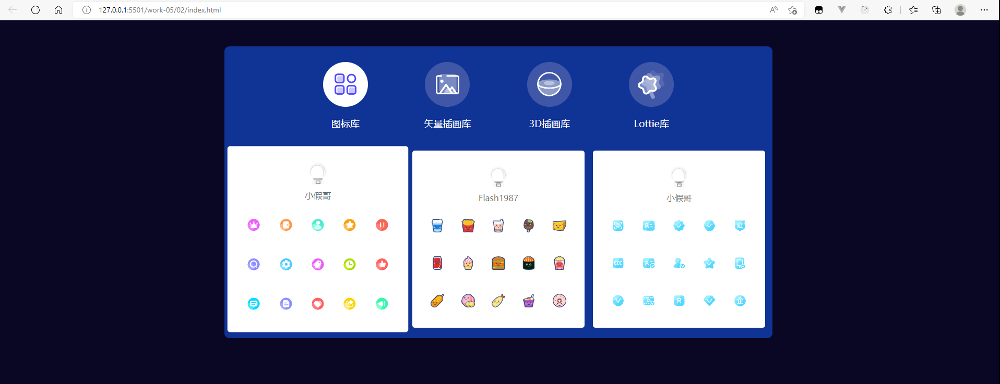
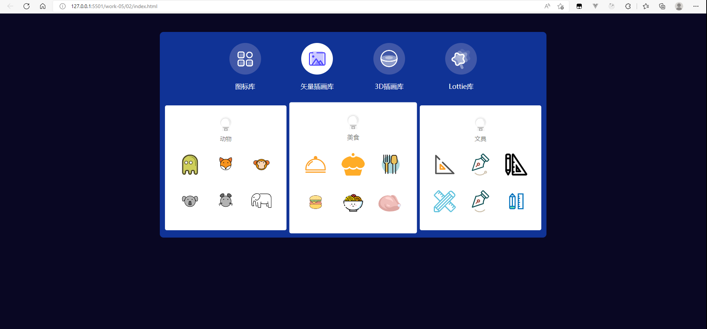

## 编写思路

### 编写静态页面
1. 使用grid布局将图标摆放好
2. 切换栏切换时，内部图片会由白色变成蓝色的另一张图片，同时将两张图片放在盒子里，但同一时间只会显示一张图片，通过js来控制

### js实现交互
1. 给切换栏的每个子项绑定点击事件，点击时，将其他的子项变为不选中状态，给当前子项添加active类名
2. 点击之后更改图标存放区里的数据，并通过判断图标数量来添加对应的类名，以获取对应的样式
3. 获取到数据之后动态创建结构

### 效果图

